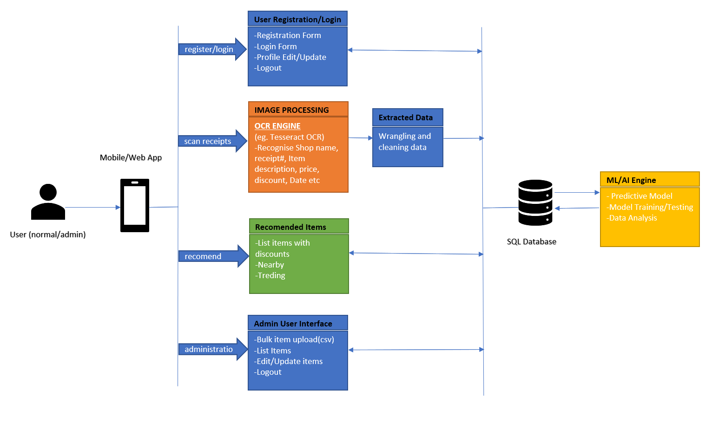

# DiscountMate Application

DiscountMate(DM) is designed to assist consumers(households) save hundreds of dollars in their grocery shopping. DM will give customers access to information about discounts from different retailers. Additionally, DM will predict future discounts on items. The application will use OCR technology to collect data from consumer receipts and apply machine learning methods to predict the discount patterns.
Short term goal is to develop an application with must have features. Long term goal is to explore and include more features by utilizing the consumer database that is being created.

## Tech Stack

DiscountMate is built using the following technologies:

- [MySql](https://www.mysql.com/)
- [MongoDB](https://www.mongodb.com/)
- [Express framework](https://expressjs.com/)
- [React Native](https://reactnative.dev/)
- [Node.js](https://nodejs.org/)

More details of the technical architecture can be found [here](documentation/technical-architecture.md).

## Data Collection

Be part of creation of Public Dataset DiscountMateDataset which will be the initial dataset used for the DiscountMate App which will help households save 1000s of dollars in their grocery shopping.
Eventually this Dataset could be used by public for education and other purposes as well. So be part of this great undertaking and contribute by collecting and sharing grocery receipts. You could

1.Physically collect the receipts and let us know via email when you are ready to hand them over. We will then arrange collection.

2.Take photo of receipts and email to discountmate@gmail.com

Note: When taking photo of the receipts please make sure:
 - the prints are visible and readable. 
 - Photo taken against a clean background
 - If the receipt is too long to capture in one photo fold it take photos of the folds, ideally renaming the folds with common prefix and numbering in sequence in      suffix. 
